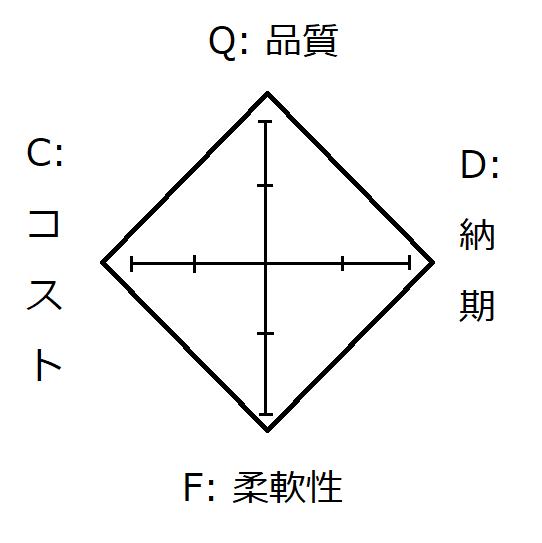

# ハードウェア・ソフトウェアの品質やコスト、納期について考える
ここに書いている内容は正しい事実ではなく、私の考え方にフォーカスしています。  
QCDFについては、厳密な正解はないと思っています。

# QCDFとは
QCDF(品質=Quality, コスト=Cost, 納期=Delivery, 柔軟性=Flexibilityの4つの指標)です。  
品質が上げればコストも上がり、納期に間に合わせようとすると品質が下がる……という、ソフトウェア業界でよく囁かれる暗黙の了解です。  
（ここでは、コスト＝コストパフォーマンスとします）

## 大前提
QCDFにおいて、私の考えを述べる前に簡単なシミュレーションをしましょう。  
  
まず、あなたに持ち点が40点渡されます。このポイントは後述のQDCFそれぞれの項目の評価を１点上げることに、原則的に１ポイント消化されます。  
また、QCDFを４つの項目に分けます。各項目において、最大値を10ポイントとして、初期値0ポイントとします。  
  
  
  
普通にやると、持ち点40点ですべての項目が最大値10点で埋まるので、きれいな正方形が出来ますね？  
しかし、現実的には

- エンジニアの得意分野（クオリティは下がるが納期を絶対に守るとか）によって、項目を１つ上げるのに消費する持ち点が異なる。
- エンジニアの質によって、上げられる上限値がある（品質は5点まで、納期は8点まで等）
- エンジニアの相性によって、成果物に逆補正が掛かることがある（コミュニケーションロスなど）例えば、人によっては完成品の評価に0.7倍する。

という複雑な問題が絡みます。
この問題に対して、追加コストを支払ってエンジニアを増員したりする事ができますが、人月の神話により一人追加されるたびにQCDFすべての最大値が0.8倍されていきます。

## 持論
私はQCDFを考える時は、以下のように考えています。

- 人の手（エンジニア）が入っている以上、どう頑張ったって品質とコストは両立できません。
- 人の手（エンジニア)が入っているものは、柔軟性を最大に高めることができます。
- オートメーションを実施することで、先述の品質・コストの問題をある程度解消し、高めることができます。
- オートメーションを実施すると柔軟性が犠牲になります。

つまり、

- 品質を求める場合、運用要件はシンプルであるべき
- 運用要件が複雑なものは人の手を介在するか、オフィスオートメーションの要件を再度見直したほうがよい
- 完全自動化とは、人が監視すらしなくて良い万全なものを指す。技術サポートや問い合わせ窓口を設置しておくだけで業務が成立するもの
- 半自動化とは、人が監視するか、人が運用するために必要な特定項目のみを制御・代行することを指す。一般的なオートメーションはこちらに該当する。

と考えます。

# 何が言いたいか
品質評価コンサルタントとして、またオートメーションQAとして、**テストに知見がない方のテストカバレッジ85%は信用してはならない**と考えます。  
色々な人eが言ってるから、という理由でなんとなくテストカバレッジや品質について意見をされると、**オートメーションではないQA**経験がある人からすると「えっ？」って話になります。  
[参考：テストカバレッジ100%を追求しても品質は高くならない理由と推奨されるカバレッジの目標値について](https://qiita.com/bremen/items/d02eb38e790b93f44728)  
  
IT講師の研修を受けて、実際にIT講師として振る舞った時の事を振り返ると、**エンジニアとしての教育は受けていてもテストを評価する教育は受けてない**ので「体系的なのではなくその方の持論で話している んだろうなぁ」と思えてならないです。  
もしホワイトボックステスト以上の範囲を担う機会が出来たエンジニアの方は、ブラックボックステスト（システムテスト）以降について再度学び直される事をおすすめします。

## 参考：ブラックボックステストのよくある誤解
私の周りで、と範囲を限定させていただきますが、「テストに時間がかかるからホワイトボックステストをしっかりやったほうが良い」という意見がありました。  
この考え方も間違いではないのですが、**ブラックボックステストは異常系の入力を受け取った時にこそ真価を発揮します。**  
そして、**異常系をテストシートにまとめることは非常に難しいです。**  
  
元セキュリティエンジニアの知見から提言いたしますが、異常系について代表的なものとして、各インジェクション攻撃やWebならXSS、CSRFを意識したテストケースを用意すると良いでしょう。  
[3分でわかるXSSとCSRFの違い](https://qiita.com/wanko5296/items/142b5b82485b0196a2da)
